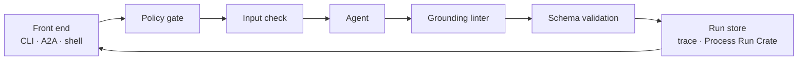

# Architecture

This page gives a short overview of how the workbench is put together. The full design is in
[`MVP_PLAN.md`](MVP_PLAN.md) §3.

## How a run works

A caller sends a request naming an agent and giving it an input. The workbench returns one
response, called an envelope. Three front ends can send requests: the command line, an A2A
JSON-RPC endpoint, and the browser shell. All three hand the request to the same function, the
[conductor](conductor.md), so an agent behaves the same whichever front end is used.

The conductor runs a fixed sequence of steps:

1. The **policy gate** checks that the institution's profile allows this agent to run.
2. The **input check** confirms the agent reads this kind of input.
3. The **agent** does its work and returns an outcome, a payload and its evidence.
4. The **grounding linter** checks the output is based only on what the agent was allowed to use
   ([`grounding.md`](grounding.md)).
5. The envelope is **validated** against the JSON Schema.
6. The run is **stored**, with its trace and a provenance record.

If a step refuses, later steps still record the refusal. The caller always gets an envelope that
says what happened. [`conductor.md`](conductor.md) describes each step in detail.

## Components

All paths are relative to `workbench/`.

| Component | What it does | Where |
|---|---|---|
| Contract | Defines the request, the envelope and every input and payload class, in LinkML. The JSON Schema and SHACL in `generated/` are produced from it. | `schema/data_director.yaml` |
| Contract models | Python (Pydantic) versions of the schema classes, schema validation and the RFC 9457 problem types. | `src/workbench/contract/` |
| Conductor | Runs the steps above. Every front end calls it. | `src/workbench/conductor.py` |
| Policy gate | Reads an institutional profile in YAML and decides whether an agent may run. | `src/workbench/policy.py`, `profiles/` |
| Tracing | Records each run as an OpenTelemetry span tree with the workbench's own `dd.*` attributes. | `src/workbench/tracing.py` |
| Grounding linter | Checks the trace and the envelope against the rules for the agent's grounding mode. | `src/workbench/grounding.py` |
| Evidence | Hashes each source record in a fixed, named way (a canonicalisation). | `src/workbench/evidence.py` |
| Store and provenance | Appends each envelope to a JSONL file, writes a folder per run, and writes a Process Run Crate. | `src/workbench/store.py`, `provenance.py` |
| Agent registry | Finds agents through Python entry points and lists what each accepts. | `src/workbench/agents/base.py`, `registry.py` |
| Agents | The agents themselves. `hello/` is the template to copy. | `src/workbench/agents/` |
| Front ends | The CLI, the A2A JSON-RPC endpoint, and the AG-UI event stream the shell uses. | `src/workbench/cli.py`, `transport/` |
| Shell | A read-only browser page that renders requests and envelopes from the generated schema. No build step. | `shell/` |
| FAIRsharing snapshot | The committed copy of FAIRsharing records that R3 uses (CC BY-SA 4.0). | `data/fairsharing/` |
| Conformance report | Maps passing tests to Blueprint requirements and generates `CONFORMANCE.md`. | `docs/requirements.yaml`, `scripts/conformance_report.py` |

## Design principles

Two principles from the plan guide what is fixed and what is written here.

**Fix the formats now; the components can change later.** The data formats are settled. These
are the identifiers, the envelope, the trace attributes, the evidence canonicalisations and the
schema's slot URIs. Changing any of them needs an ADR. The components that produce and consume
those formats sit behind interfaces and can be replaced. Agents, retrieval back ends, model
explainers and front ends are all replaceable.

**Use existing libraries for plumbing; write our own code for governance.** The workbench writes
its own code only where it makes a governance decision. These decisions are whether an action is
permitted, whether the evidence is enough, and whether to decline. Everything else, such as
tracing, schema validation and RO-Crate output, uses a maintained library behind a thin module
([ADR-0006](adr/0006-dependency-tiering.md)).

## Decisions

Each design decision has a record in [`adr/`](adr/):

| ADR | Subject |
|---|---|
| [0001](adr/0001-transport.md) | Transport |
| [0002](adr/0002-opentelemetry.md) | OpenTelemetry |
| [0003](adr/0003-policy-profiles.md) | Policy profiles |
| [0004](adr/0004-identifiers-and-problems.md) | UUIDv7 identifiers and Problem Details |
| [0005](adr/0005-dataset-profile-and-validation.md) | `DatasetProfile` and the validation format |
| [0006](adr/0006-dependency-tiering.md) | Dependency tiering |
| [0007](adr/0007-polymorphic-contract.md) | Polymorphic contract |
| [0008](adr/0008-grounding-modes.md) | Grounding modes |
| [0009](adr/0009-evidence-canonicalisations.md) | Evidence canonicalisations |
| [0010](adr/0010-agent-registry.md) | Agent registry |
