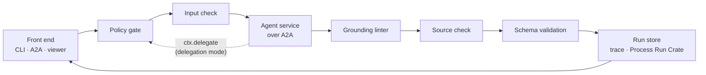

# Architecture

This page gives a short overview of how the workbench is put together. The decisions behind it
are recorded in [`adr/`](adr/).

## How a run works

A caller sends a request naming an agent and giving it an input. The workbench returns one
response, called an envelope. Three front ends can send requests: the command line, an A2A
JSON-RPC endpoint, and the web viewer. All three hand the request to the same function, the
[conductor](conductor.md), so an agent behaves the same whichever front end is used.

Agents are separate services. The conductor reaches each one over A2A and gets back the
agent's result together with the trace spans the agent recorded
([ADR-0011](adr/0011-remote-agents.md)). The conductor runs a fixed sequence of steps:

1. The **policy gate** checks that the institution's profile allows this agent to run.
2. The **input check** confirms the agent reads this kind of input.
3. The **agent** does its work in its own process and returns an outcome, a payload, its
   evidence and its trace spans. The conductor adds the spans to the run's trace. An agent in
   grounding mode `delegation`, such as an orchestrator, may ask the workbench to run another
   agent through `ctx.delegate`. Each delegated run goes through every step here as a run of its
   own, and the conductor records it in the parent envelope's `delegations`
   ([ADR-0012](adr/0012-conversation-and-orchestration.md)).
4. The **grounding linter** checks that the agent's account of its run is consistent: the
   output cites only what its grounding mode allows, and what the agent says it retrieved
   ([`grounding.md`](grounding.md)). It is a consistency check, not proof of retrieval.
5. The **source check** re-hashes each cited record against a pinned copy of the source that
   the workbench holds ([ADR-0016](adr/0016-source-check.md)).
6. The envelope is **validated** against the JSON Schema.
7. The run is **stored**, with its trace and a provenance record.

If a step refuses, later steps still record the refusal. The caller always gets an envelope that
says what happened. [`conductor.md`](conductor.md) describes each step in detail.

## Components

The repository is a uv workspace with three kinds of package. `sdk/` holds everything an agent
and the workbench share. `workbench/` is the harness. `agents/` holds one package per agent,
each run as its own service. Paths below are relative to the repository root.

| Component | What it does | Where |
|---|---|---|
| Contract | Defines the request, the envelope and every input and payload class, in LinkML. The JSON Schema and SHACL in `generated/` are produced from it. | `sdk/src/dd_sdk/schema/data_director.yaml` |
| Contract models | Python (Pydantic) versions of the schema classes, schema validation and the RFC 9457 problem types. | `sdk/src/dd_sdk/contract/` |
| Agent interface | `AgentSpec`, `AgentResult`, `RunContext`, and the one manifest (`describe`). | `sdk/src/dd_sdk/agent.py` |
| Agent server | Serves one agent over A2A. It publishes the agent card with the spec extension, runs the agent under a tracer parented to the caller's span, and returns the result and spans. | `sdk/src/dd_sdk/serve.py`, `wire.py` |
| Tracing | Records each run as an OpenTelemetry span tree with the workbench's own `dd.*` attributes. | `sdk/src/dd_sdk/tracing.py` |
| Evidence | Hashes each source record in a fixed, named way (a canonicalisation). | `sdk/src/dd_sdk/evidence.py` |
| Conductor | Runs the steps above. Every front end calls it. | `workbench/src/workbench/conductor.py` |
| Policy gate | Reads an institutional profile in YAML and decides whether an agent may run. | `workbench/src/workbench/policy.py`, `workbench/profiles/` |
| Grounding linter | Checks the trace and the envelope against the rules for the agent's grounding mode. | `workbench/src/workbench/grounding.py` |
| Source check | Re-hashes cited records against the pinned source copies listed in `sources.yaml`. | `workbench/src/workbench/sources.py`, `workbench/sources.yaml` |
| Store and provenance | Appends each envelope to a JSONL file, writes a folder per run, and writes a Process Run Crate. | `workbench/src/workbench/store.py`, `provenance.py` |
| Agent registry | Reads `agents.yaml`, fetches each agent's card and rebuilds its spec. `RemoteAgent` calls the agent over A2A. See [`registry.md`](registry.md). | `workbench/agents.yaml`, `workbench/src/workbench/registry.py`, `remote.py` |
| Front ends | The CLI, the A2A JSON-RPC endpoint, and the AG-UI event stream the viewer uses. | `workbench/src/workbench/cli.py`, `transport/` |
| Viewer | Two read-only browser pages, Inspect and Chat, that render requests and envelopes from the generated schema. No build step. | `workbench/viewer/` |
| Test kit | Serves an agent in memory for tests, and a scripted agent for harness tests. | `workbench/src/workbench/testing.py` |
| Conformance report | Maps passing tests and recorded human reviews to requirements and generates `CONFORMANCE.md`. See [`conformance.md`](conformance.md). | `workbench/docs/requirements.yaml`, `workbench/docs/reviews.yaml`, `workbench/scripts/conformance_report.py` |
| Agents | One package and one service per agent. `hello/` is the template to copy. | `agents/` |
| FAIRsharing snapshot | The committed copy of FAIRsharing records that R3 uses (CC BY-SA 4.0). | `agents/r3/data/fairsharing/` |

## Design principles

Two principles guide what is fixed and what is written here.

**Fix the formats now; the components can change later.** The data formats are settled. These
are the identifiers, the envelope, the trace attributes, the evidence canonicalisations and the
schema's slot URIs. Changing any of them needs an ADR. The components that produce and consume
those formats sit behind interfaces and can be replaced. Agents, retrieval back ends, model
explainers and front ends are all replaceable.

**Use existing libraries for plumbing; write our own code for governance.** The workbench writes
its own code only where it makes a governance decision. These decisions are whether an action is
permitted, whether the evidence is enough, and whether to decline. Everything else, such as
tracing, schema validation and RO-Crate output, uses a maintained library behind a thin module
([ADR-0006](adr/0006-dependency-tiering.md)).

## Decisions

Each design decision has a record in [`adr/`](adr/):

| ADR | Subject |
|---|---|
| [0001](adr/0001-transport.md) | Transport |
| [0002](adr/0002-opentelemetry.md) | OpenTelemetry |
| [0003](adr/0003-policy-profiles.md) | Policy profiles |
| [0004](adr/0004-identifiers-and-problems.md) | UUIDv7 identifiers and Problem Details |
| [0005](adr/0005-dataset-profile-and-validation.md) | `DatasetProfile` and the validation format |
| [0006](adr/0006-dependency-tiering.md) | Dependency tiering |
| [0007](adr/0007-polymorphic-contract.md) | Polymorphic contract |
| [0008](adr/0008-grounding-modes.md) | Grounding modes |
| [0009](adr/0009-evidence-canonicalisations.md) | Evidence canonicalisations |
| [0010](adr/0010-agent-registry.md) | Agent registry (superseded by 0011) |
| [0011](adr/0011-remote-agents.md) | Agents as separate A2A services |
| [0012](adr/0012-conversation-and-orchestration.md) | Conversations, and orchestration through the workbench |
| [0013](adr/0013-evaluation.md) | Evaluation is not conformance |
| [0014](adr/0014-assessment-lanes.md) | Assessment lanes: tests and recorded reviews |
| [0015](adr/0015-evidence-carries-content.md) | Evidence carries the content its hash covers |
| [0016](adr/0016-source-check.md) | The linter checks consistency; a source check verifies citations |
